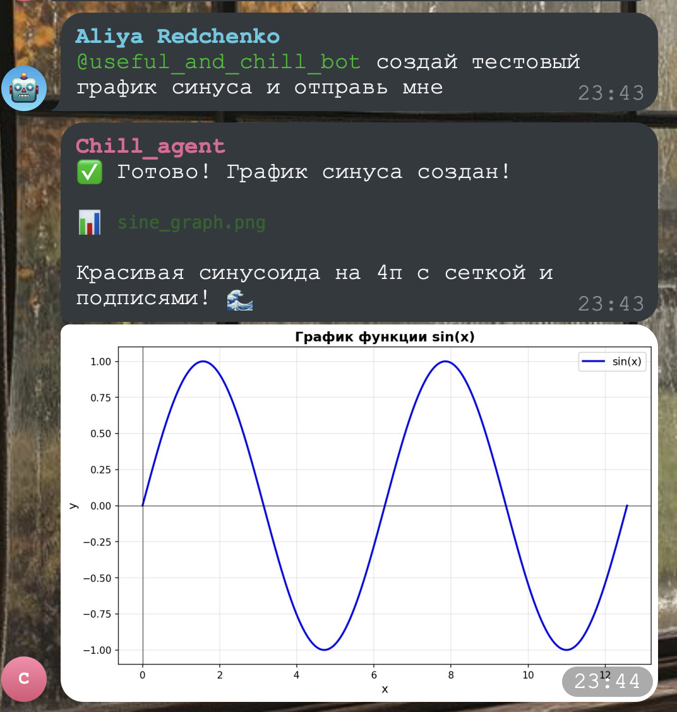
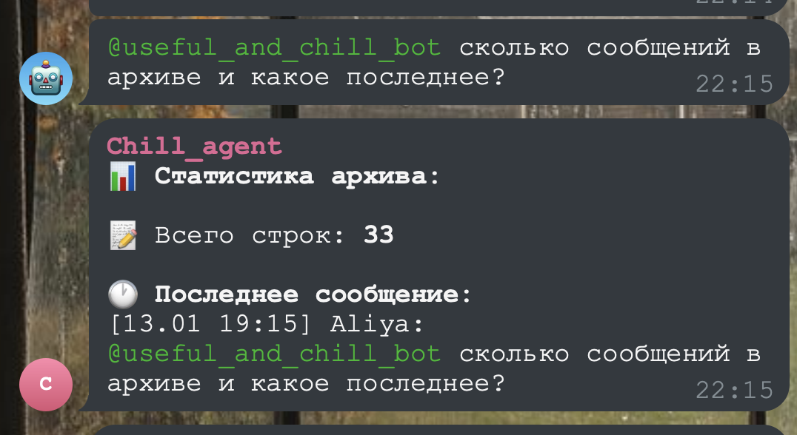
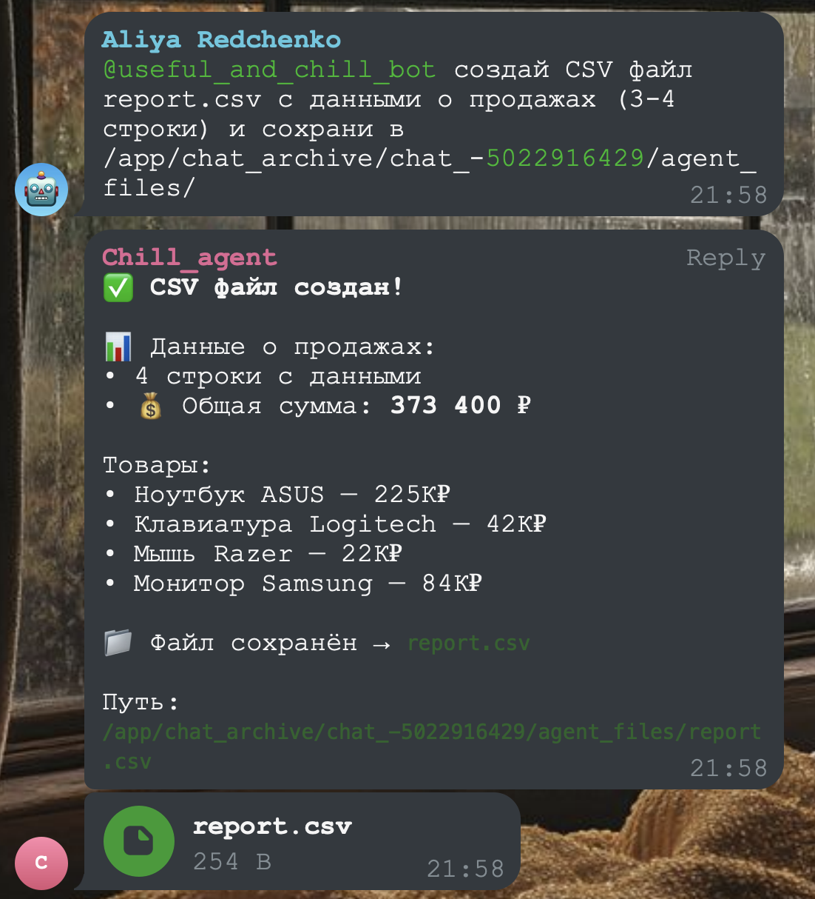
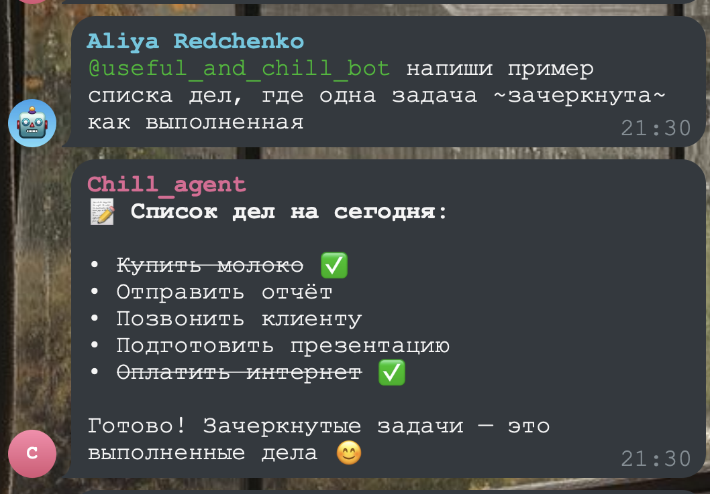
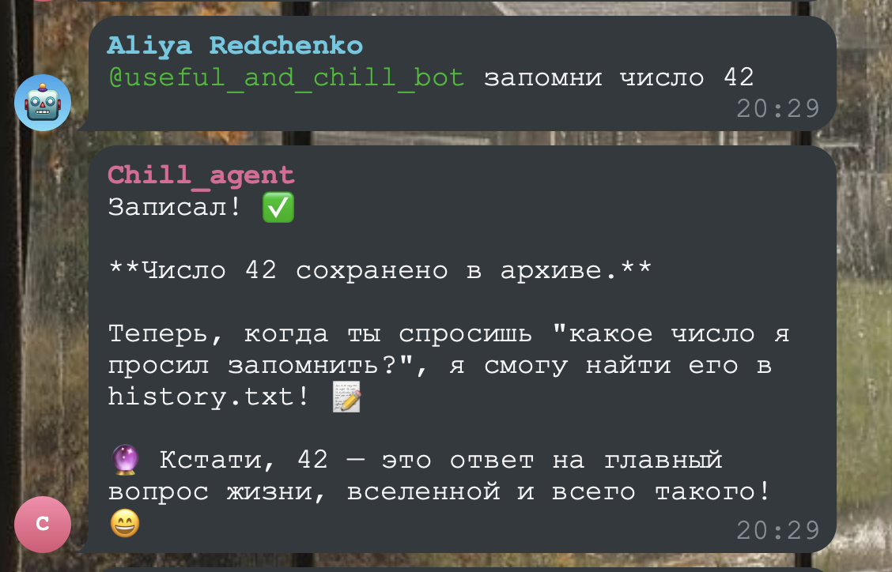

# Telegram AI Bot

Telegram-бот с AI-агентом для архивации чатов и аналитики на базе Claude Agent SDK.

---

## Агентный подход к разработке

Этот проект разрабатывается с использованием **агентного кодинга** — AI-агенты самостоятельно берут задачи, реализуют их, тестируют и коммитят результат.

### Что подготовлено

```
agent/                        # Всё для работы агентов
├── AGENT.md                  # Пошаговая инструкция
├── FEATURES.md               # 25 задач с BDD-сценариями
├── progress.txt              # Визуальный трекер прогресса
├── PRD.md                    # Техническое задание
├── claude_agent_sdk_tips.md  # Cookbook по Claude SDK
└── telegram_userbot_tips.md  # Cookbook по Telethon

userbot_tester/               # Интерактивное тестирование
├── userbot.py                # Отслеживает все события бота
└── send.sh                   # Отправка тестовых сообщений
```

### Как работает процесс

```
┌─────────────────────────────────────────────────────────────────┐
│                         AGENT WORKFLOW                          │
└─────────────────────────────────────────────────────────────────┘

1. ОЗНАКОМЛЕНИЕ
   ┌──────────┐
   │  Агент   │──▶ Читает progress.txt (что уже сделано?)
   └──────────┘──▶ Читает FEATURES.md (какие задачи есть?)
              ──▶ Читает PRD.md (ТЗ)

2. ВЫБОР ЗАДАЧИ
   ┌──────────┐
   │  Агент   │──▶ Находит задачу [ ] (TODO)
   └──────────┘──▶ Учитывает приоритет и зависимости
              ──▶ Меняет статус на [~] (IN_PROGRESS)

3. РАЗРАБОТКА
   ┌──────────┐
   │  Агент   │──▶ Пишет код по BDD-сценариям
   └──────────┘──▶ Использует docker compose
              ──▶ Сверяется с cookbooks

4. ТЕСТИРОВАНИЕ (обязательно!)
   ┌──────────┐     ┌─────────────────┐
   │  Агент   │────▶│ userbot_tester  │
   └──────────┘     └─────────────────┘
        │                   │
        │  ./send.sh        │  Логирует:
        │  "@bot тест"      │  - ответы бота
        │                   │  - редактирования (статусы)
        └───────────────────│  - отправку файлов
                            ▼
                    logs/log_YYYYMMDD.txt

5. ЗАВЕРШЕНИЕ
   ┌──────────┐
   │  Агент   │──▶ Меняет статус на [x] (DONE)
   └──────────┘──▶ Обновляет progress.txt
              ──▶ git commit + push
```

### Примеры работы: агент-разработчик тестирует свой код

Агент не только пишет код, но и **самостоятельно проверяет** работу бота! Вот реальные примеры того, как агент-разработчик сам задает боту вопросы для тестирования функциональности:



*Тестирование генерации изображений: агент проверяет, как бот рисует график sin(x)*



*Тестирование работы с архивом: проверка подсчета строк и извлечения последнего сообщения*



*Тестирование автоотправки файлов: агент создает CSV и указывает путь - файл автоматически отправляется в Telegram*



*Тестирование markdown-форматирования: проверка списков с галочками и зачеркиванием*



*Тестирование памяти агента: сохранение и воспроизведение числа 42 из архива*

### Пример работы агента

```bash
# Агент читает текущий статус
cat agent/progress.txt
# > Готово: 3 / 25 задач (12%)
# > В работе: 0

# Агент смотрит доступные задачи
grep "### .* \[ \]" agent/FEATURES.md
# > ### 1.3 [ ] Логирование системных событий
# > ### 2.1 [ ] Сохранение фото

# Агент берёт задачу — меняет [ ] на [~]
# Агент пишет код...
# Агент тестирует через userbot_tester

cd userbot_tester
./send.sh "@bot сколько сообщений в архиве?"
# Проверяет логи — бот ответил? статусы менялись?

# Успех! Агент меняет [~] на [x]
# Агент коммитит
git add -A
git commit -m "Complete: Logging system events"
git push
```

### BDD-сценарии

Каждая задача имеет Gherkin-сценарии для тестирования:

```gherkin
Feature: Text message archiving

  Scenario: Text message is saved to history
    Given user "Алия" sends message "Привет, бот!"
    And current time is "13.01 15:30"
    When the message is processed
    Then history.txt contains line "[13.01 15:30] Алия: Привет, бот!"
```

Агент следует этим сценариям при реализации и тестировании.

### Вдохновение

Подход к организации агентного кодинга основан на:

- **Курс Алексея Комиссарова** — «Программирование на естественном языке»
- **Anthropic Engineering** — [Effective harnesses for long-running agents](https://www.anthropic.com/engineering/effective-harnesses-for-long-running-agents)

---

## Технологии

- **Python 3.11+**
- **aiogram 3.x** — Telegram бот
- **Claude Agent SDK** — AI-агент с инструментами (Read, Bash, Grep, Glob)
- **Telethon** — userbot для тестирования
- **Docker Compose** — оркестрация

---

## Быстрый старт

```bash
# Клонировать
git clone https://github.com/aliyaredpilled/bot_for_entrepreneur.git
cd bot_for_entrepreneur

# Настроить окружение
cp .env.example .env
# Заполнить BOT_TOKEN и CLAUDE_CODE_OAUTH_TOKEN

# Запустить
docker compose up -d

# Логи
docker compose logs -f
```

---

## Для агентов

Если ты AI-агент — начни с:

```bash
cat agent/AGENT.md
```

Там полная инструкция по воркфлоу.

---

## Прогресс

<!-- Автоматически обновляется агентами -->
```
Задач:    28
Готово:   25
В работе: 0

[██████████████████░░] 89%
```

Детали в [agent/FEATURES.md](agent/FEATURES.md)

---

## Лицензия

MIT
